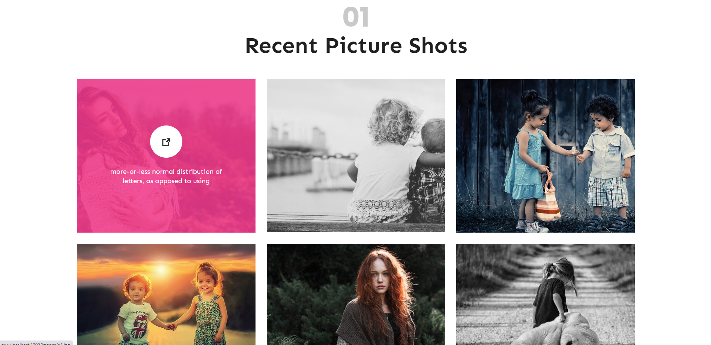

# photographer-social-platform_nodejs

🔸 Social platform about photopraph .... <br>
🔸 This web app built with using [React](https://reactjs.org/). <br>

## 💻 Setup <br>

### Install Dependencies

```
npm install
```

### Run the App in the Dev Server

```
npm start
```

### to Build for Production

```
npm build
```

## 🔥 Technologies and Libraries <br>

✔️ Node.js <br>
✔️ express.js <br>
✔️ bcrypt <br>
✔️ cookie-parser <br>
✔️ dotenv <br>
✔️ ejs <br>
✔️ jsonwebtoken <br>
✔️ validator <br>
✔️ mongoose <br>
✔️ express-fileupload <br>
✔️ method-override <br>

## 🚀 App Features <br>

✔️ User can delete, add and update photos. <br>
✔️ User can follow other users. There is a tracking system. <br>
✔️ There is a user authentication system. <br>
✔️ Users can take action according to their authority and see different pages. <br>
✔️ User can send e-mail. <br>
✔️ App have MVC structure. <br>

## 📷 Screenshot <hr>


<br>
<br>

<br>
<br>

